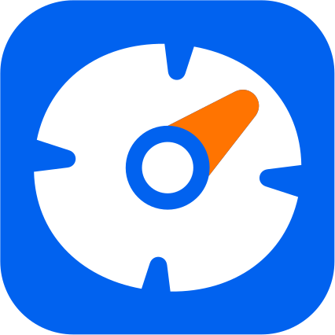
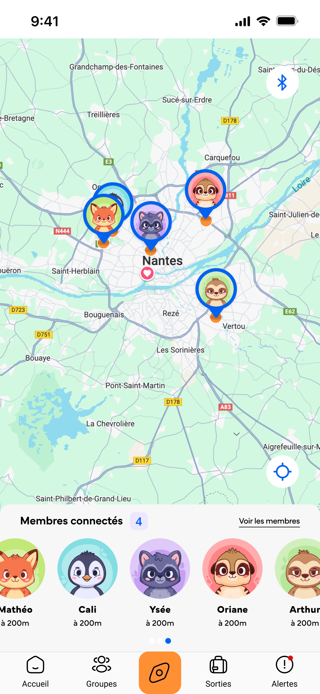

#  Linko - PWA / App Mobile et Bracelet connecté

## 💻 Démo en ligne

➡️[https://linko-flame.vercel.app/](https://linko-flame.vercel.app/)⬅️


## Table des matières

1. [Notre Équipe](#-1-notre-équipe)
2. [Description](#-2-description)
3. [Stack technique](#-3-stack-technique)
4. [Fonctionnaliés](#4-fonctionnalités)
5. [Tester le projet](#-5-tester-le-projet)
6. [Architecture du projet](#-6-architecture-du-projet)
7. [Références](#7-références)

## ✨ 1. Notre équipe

- **Boisneau Ysée** : Présence & Marketing Digital
- **Jaunasse Cali** : Webmarketing & Social Média
- **Lebehot Mathéo** : Webdesign - UX/UI
- **Ploteau Arthur** : Graphiste - Designer
- **Ratelade Oriane** : Développeuse

## 📜 2. Description

Dans les **milieux scolaires**, **parascolaires**, ou encore les **colonies**, la sécurité et la
coordination lors des déplacements sont des enjeux cruciaux. En effet, les encadrants
doivent surveiller de nombreux enfants en même temps, et parfois certains
s’éloignent ou se perdent, ce qui provoque du stress et de l’inquiétude, à la fois chez
les encadrants, les professeurs et aussi les parents.

Notre projet est donc né afin de répondre à cette problématique : **assurer la sécurité**,
**superviser les plus jeunes en déplacement**. Notre solution ne vise pas la surprotection,
nous proposons une solution fiable et intuitive, afin de simplifier le travail des
encadrants mais aussi garantir la sécurité des plus petits.

## 🚀 3. Stack technique

| Catégorie       | Technologie                                                                                                                                                                                                  |
| --------------- | ------------------------------------------------------------------------------------------------------------------------------------------------------------------------------------------------------------ |
| Langage         |                                                                                            |
| Framework (PWA) |                                                                                                     |
| App (futur)     |                                                                                            |
| Backend         |                                                                                                  |
| Auth            |                                                                                       |
| CI/CD           |  |
| UI              |                                                                                         |

## 4. Fonctionnalités

### 4.1 Localisation



### 4.2 Écran d'accueil

### 4.3 Gestion des sorties

### 4.4 Gestion des groupes

### 4.5 Gestion des alertes

## ✅ 5. Tester le projet

Maintenant que vous savez tout de nous, laissez-vous guider pas à pas ! ✨

### 5.1 Prérequis

- Node.js ≥ 18
- yarn

### 5.2 Installer le projet

📂 **Clônez le dépôt**

```bash
# HTTPS
git clone https://github.com/orinaya/linko-react-pwa.git

# SSH
git clone git@github.com:orinaya/linko-react-pwa.git
```

📦 **Installez les modules**

```
yarn install
```

### 5.3 Lancer le projet

Pour démarrer le serveur de développement, exécutez la commande suivante à la racine du projet :

```bash
yarn dev
```

🔐 Il vous faudra ensuite créer à la racine du projet un fichier `.env` à partir du fichier `.env.example`

```bash
cp .env.example .env
```

L'envrionnement de développement sera disponible sur à l'url : http://localhost:3000

## 📂 6. Architecture du projet

```bash
linko-react-pwa
├─ jsconfig.json # config chemin relatif
├─ next.config.mjs # config next.js
├─ package.json # liste les dépendances
├─ postcss.config.mjs # config postcss tailwind
├─ public
│  ├─ assets
│  │  ├─ fonts
│  │  └─ images
│  └─ manifest.json # contient infos pour PWA (favicon, metadatas, langue, couleurs etc)
├─ README.md
├─ src
│  ├─ app # contient toutes les pages naviguables
│  │  ├─ ....
│  │  ├─ trips/
│  │  ├─ layout.js # layout global
│  │  ├─ page.js #landing lien => "/"
│  │  └─ globals.css
│  ├─ components # contient toutes les composants de la landing, du layout global etc
│  │  ├─ landing-page/
│  │  ├─ layout/
│  │  └─ particles/
│  ├─ contexts/ # contient les contexts (global, ex : Auth)
│  ├─ datas/ # contient les données en dur (ex: FAQ)
│  ├─ hooks/ # contient les hooks (données réutilisables)
│  ├─ services/ # conenxion auth api supabase
│  │  ├─ auth/
│  │  └─ user-datas/
│  └─ utils/ # fonctions utilitaires (ex: slugify le text pour les url, formattage de dates)
└─ yarn.lock
```

## 7. Documentation

    Figma : https://www.figma.com/design/0CeoVDVN9U83cmWPsFZlMY/Vitrine-Projet---LINKO?node-id=12-3

## 8. Remarques

    Le projet est en phase MVP

    Les fonctionnalités de bracelet BLE sont en cours d’intégration

## 9. Références

- [Next.js Documentation](https://nextjs.org/docs) - learn about Next.js features and API.
- [Learn Next.js](https://nextjs.org/learn) - an interactive Next.js tutorial.
